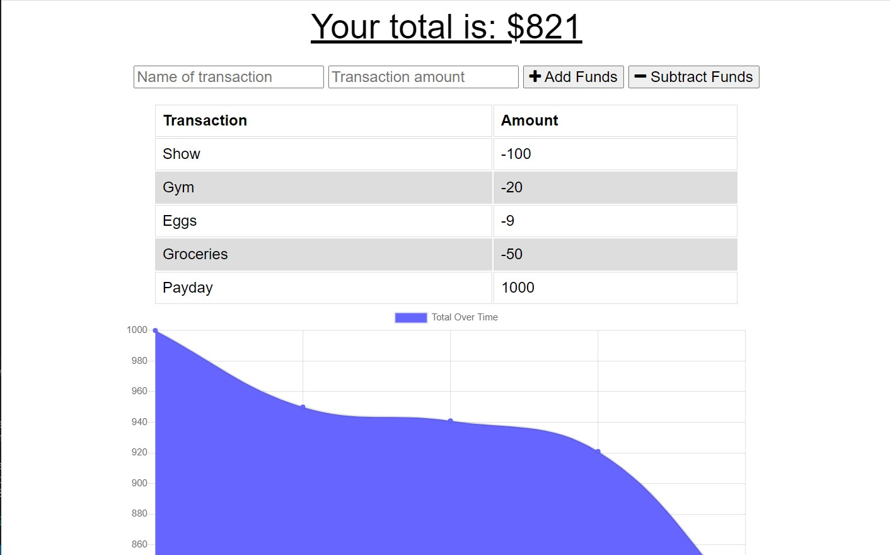

# Budget Tracker


## Description

The budget tracker allows a user to track their spending habits by storing income and purchases.

### _Visit this website by clicking the link below_
[Budget Tracker](https://budget-tracker117.herokuapp.com/)



## Table of Contents 

* [Installation](#installation)

* [Usage](#usage)

* [License](#license)

* [Contribution Guidelines](#contribution-guidelines)

* [Tests](#tests)

* [Questions](#questions)

## Installation

Run the following command to install dependencies:

```
npm install
```

## Usage

To use this application simply input a name of a transaction and the amount of the transaction, then click either add funds or subtract funds to specify whether it is income or a purchase. The transactions will be stored and displayed and your current total will be displayed at the top of the page.

## License

This project is licensed under MIT

## Contribution Guidelines

Currently there are no contribution guidelines for this repo.

## Tests

Run the following command in the terminal to run tests:

```
no tests currently for this repo
```

## Questions

If you have any questions regarding this repo, you may contact me at tniles320@gmail.com. To see my other work, follow this link: [GitHub](https://github.com/tniles320/).